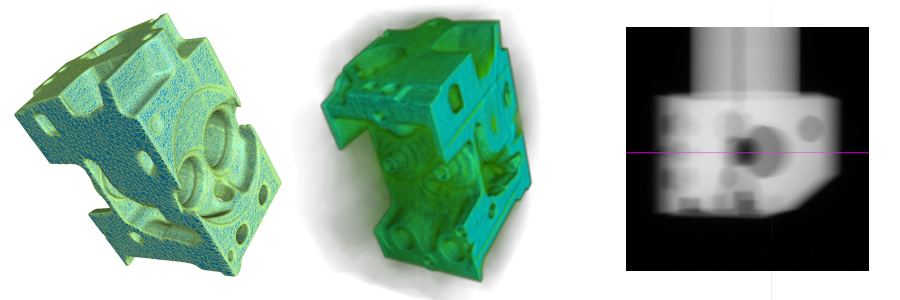
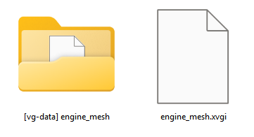

# Introduction
The VG NDE SDK contains python interfaces to write the .xvgi file format. XVGI is a simple text format that enables the
easy import of supported data into VG software. It is also possible to add pre-defined or custom meta information for
the imported objects, for use in reporting or data exports, e.g. when connecting to Q-DAS products.

Three kinds of data can be described by .xvgi files:
 * Volume data
 * Mesh data
 * Projection data for reconstruction.

One or more objects of each data type can be described, and different data types can also be mixed, e.g. to import
a volume object and a mesh object into the same project.

> Oftentimes .vgl projects can already be created by the software of the acquisition system. In these cases there
> is no benefit to using the VG NDE SDK. 

# Describing data for import

The data that is supposed to be imported must be described using the structures provided by the SDK. The three 
classes for holding all import parameters are the `VolumeSection`, the `MeshSection` and the `ReconstructionSection`.
The parameters necessary to set up the import of the data mirror the parameters available in the various importers
in VG software. A good way to set up .xvgi files for certain data is to first manually configure the import in VG
software, making sure it works, and then setting up a corresponding section object.
The parameter objects must then be written to an .xvgi file using the `XVGIWriter`. VG software always assumes .xvgi
files to be UTF-8 encoded, so be sure to set the correct encoding when writing the file.

The section classes also contain documentation for all parameters. HTML documentation for them can be generated in
the docs folder like so:
 ```shell
  make html
 ```

> The `examples` folder contains examples of how to create files referencing volume or mesh data, or projections for 
> reconstruction.
 
# Referenced data

.xvgi files reference the data that is to be imported via absolute file paths. These file paths must be accessible to
the application loading the .xvgi file, making it dependent on the original location of the data. If the
referenced data is intended to be moved or copied together with the .xvgi file (and the .vgl file eventually created 
from it), a **[vg-data] folder** must be used.

# [vg-data] folder

Data that is referenced by the file **test.xvgi** can be stored in the matching **[vg-data] test** folder. Any file
paths that point into a [vg-data] folder using the same name as an .xvgi file will be automatically adjusted to point
into the [vg-data] folder next to the .xvgi file when it is loaded. Organizing and referencing data this way ensures
that .xvgi files and their associated [vg-data] folder can be moved and copied around easily.



# Using .xvgi files
VG software products starting from 2025.1 version are able to load these files, and support their use in
 * Open
 * Merge object(s)
 * Batch processing

.xvgi files are compatible with VG software version as new as or newer than the VG NDE SDK version that was used
to write the file. VG software older than the SDK version used to create an .xvgi file might not be able to load these
files. Currently all files created with this SDK are compatible with VG software version 2025.1 and above. 

Once loaded, the resulting project can be saved as a normal .vgl file, and the .xvgi file is no longer necessary.
It is only used for the initial import of the data, and can be discarded. It is strongly recommended to use the name
of the .xvgi file when saving, as is proposed by the software. This helps maintaining the association with referenced
data.

> myVGL can not open .xvgi files. A licensed application needs to be used to turn the .xvgi file into a .vgl file, which
> can then be viewed in myVGL in the usual way.

# Requirements

Requires Python 3.9 or newer.

