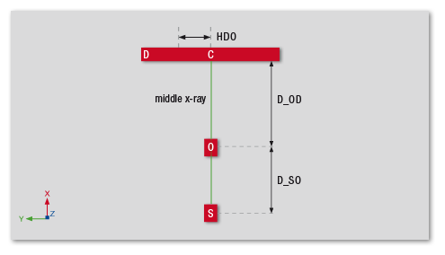
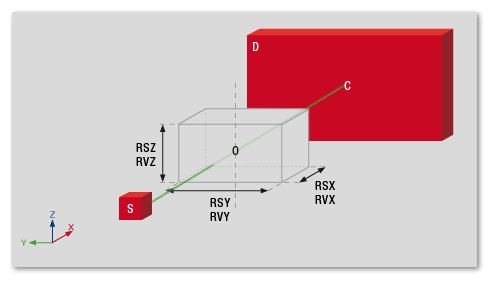
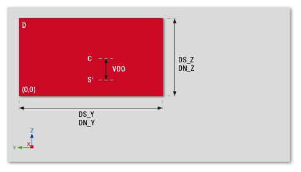
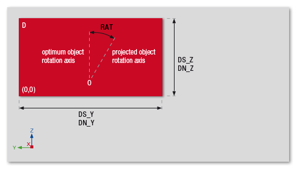
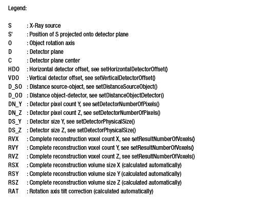

=========================================
Describing projection data
=========================================

General
~~~~~~~

In order to save a VG reconstruction project, you have to create an instance of the class Project
with the project type Reconstruction. You can then set up one ore more reconstructions using the ReconstructionDescriptor class.
When the project is loaded into a reconstruction-enabled VG application, the projection files referenced by the ReconstructionDescriptor(s)
will be reconstructed into volumes that become part of the scene.

* ReconstructionDescriptor class for detailed parameter description
* examples/reconstructions for a simple reconstruction example
* docs/vg-reconstruction-conventions.pdf for details about the general reconstruction conventions
* docs/vg-reconstruction-planar.pdf for details about the supported setups of planar CT

General concepts of project creation can be found \ref PageVolumeGraphicsProject "here".

Reconstruction modes and parameters
~~~~~~~~~~~~~~~~~~~~~~~~~~~~~~~~~~~

The VG NDE SDK currently supports five different reconstruction modes.

#. Feldkamp - Standard cone beam setup.
#. Parallel - Parallel beam setup, as used in linear accelerators.
#. Planar - Two different setups are supported, see docs/vg-reconstruction-planar.pdf for details. Most commonly used for BGA (Ball Grid Array) scans.
#. Line - Standard line CT setup for none-curved detectors.
#. Spiral - Helix path CT setup based on Feldkamp reconstruction algorithm.  

You will have to choose the mode according to the geometric setup of your CT.  
Not all parameters available through the ReconstructionDescriptor are supported by all reconstruction modes.
Some parameters will only have an effect in a single mode, while others are taken into account no matter
which reconstruction mode is selected.   

.. csv-table::  
   :header: "GeneralSystemGeometryMode","Cone beam CT","Parallel beam CT","Planar CT","Fan beam CT","Helix CT"
   
   "AlgorithmicOptimizationMode","Yes","Yes","Yes","No","Yes"
   "AlgorithmMode","Yes","Yes","Yes[1]","Yes","Yes"
   "AngularDifferenceCorrection","No","No","Yes[2]","No","No"
   "AngularOffset","Yes","Yes","Yes","Yes","Yes"
   "AngularSection","Yes","Yes","Yes","Yes","Yes"
   "ArtNumberOfIterations","Yes","Yes","Yes[1]","Yes","Yes"
   "ArtRelaxationFactor","Yes","Yes","Yes[1]","Yes","Yes"
   "AutoRegionOfInterestMode","Yes","Yes","No","Yes","Yes"
   "BeamHardeningCorrectionMode","Yes","Yes","Yes","Yes","Yes"
   "BeamHardeningCorrectionPreset","Yes","Yes","Yes","Yes","Yes"
   "BeamHardeningCorrectionPresetMode","Yes","Yes","Yes","Yes","Yes"
   "BeamHardeningCorrectionPresetValueRange","Yes","Yes","Yes","Yes","Yes"
   "CalculationMode","Yes","Yes","Yes","Yes","Yes"
   "CalibrationBrightFile","Yes","Yes","Yes","Yes","Yes"
   "CalibrationDarkFile","Yes","Yes","Yes","Yes","Yes"
   "CalibrationFilterMode","Yes","Yes","Yes","Yes","Yes"
   "CalibrationMode","Yes","Yes","Yes","Yes","Yes"
   "ClampHighMode","Yes","Yes","Yes","Yes","Yes"
   "ClampHighType","Yes","Yes","Yes","Yes","Yes"
   "ClampHighValue","Yes","Yes","Yes","Yes","Yes"
   "ClampLowMode","Yes","Yes","Yes","Yes","Yes"
   "ClampLowType","Yes","Yes","Yes","Yes","Yes"
   "ClampLowValue","Yes","Yes","Yes","Yes","Yes"
   "DistanceObjectDetector","Yes","No","Yes","Yes","Yes"
   "DistanceSourceObject","Yes","No","Yes","Yes","Yes"
   "FieldOfViewExtensionMode","Yes","Yes","Yes[4]","Yes","Yes"
   "FilterMode","Yes","Yes","Yes","Yes","Yes"
   "GeometricSetup","No","No","Yes","No","No"
   "HorizontalDetectorOffset","Yes","Yes","Yes","Yes","Yes"
   "HorizontalDetectorOffsetPosition","Yes","Yes","Yes","Yes","Yes"
   "IgnoreBorderPixels","Yes","Yes","Yes","Yes","Yes"
   "IntensityCorrectionBias","Yes","Yes","Yes","Yes","Yes"
   "InterpolationMode","Yes","Yes","Yes","Yes","Yes"
   "LaminographyAngle","No","No","Yes","No","No"
   "LiftingAxisTiltCorrection","No","No","No","No","Yes"
   "SlicePositionList","No","No","No","Yes","No"
   "ManualResultVolumeSpecificationMode","Yes","Yes","Yes","Yes","Yes"
   "MetalArtifactReductionMode","Yes","Yes","No","No","No"
   "MetalArtifactReductionStrength","Yes","Yes","No","No","No"
   "MetalArtifactReductionThreshold","Yes","Yes","No","No","No"
   "MetalArtifactReductionThresholdMode","Yes","Yes","No","No","No"
   "MisalignmentCorrectionMode","Yes","Yes","No","Yes","No"
   "MisalignmentSkip","Yes","Yes","No","Yes","No"
   "MisalignmentSkipMode","Yes","Yes","No","Yes","No"
   "VerticalDetectorOffset","Yes","Yes","Yes","Yes","Yes"
   "ObjectNameInScene","Yes","Yes","Yes","Yes","Yes"
   "PreprocessingMode","Yes","Yes","Yes","Yes","Yes"
   "ProjectionCompletionTimeout","Yes","Yes","Yes","Yes","Yes"
   "ProjectionDataType","Yes","Yes","Yes","Yes","Yes"
   "ProjectionFileEndian","Yes","Yes","Yes","Yes","Yes"
   "ProjectionFileFormat","Yes","Yes","Yes","Yes","Yes"
   "ProjectionFileNameList","Yes","Yes","Yes","Yes","Yes"
   "ProjectionFiles(includingangles)","Yes","Yes","Yes","No","Yes[5]"
   "ProjectionHeaderSkip","Yes","Yes","Yes","Yes","Yes"
   "ProjectionMirrorAxisY","Yes","Yes","Yes","Yes","Yes"
   "ProjectionMirrorAxisZ","Yes","Yes","Yes","Yes","Yes"
   "ProjectionMirrorBrightness","Yes","Yes","Yes","Yes","Yes"
   "ProjectionNumberOfPixels","Yes","Yes","Yes","Yes","Yes"
   "ProjectionOrientation","Yes","Yes","Yes","Yes","Yes"
   "ProjectionPhysicalSize","Yes","Yes","Yes","Yes","Yes"
   "ProjectionReadTimeout","Yes","Yes","Yes","Yes","Yes"
   "ProjectionSkip","Yes","Yes","Yes","Yes","Yes"
   "ProjectionSkipAngle","Yes","Yes","Yes","Yes","Yes"
   "ProjectionSmoothingMode","Yes","Yes","Yes","Yes","Yes"
   "ProjectionSorting","Yes","Yes","Yes","Yes","Yes"
   "RadiationIntensityCompensationMode","Yes","Yes","No","No","Yes"
   "ReconstructionSkip","Yes","Yes","Yes","Yes","Yes"
   "RegionOfInterestList","Yes","Yes","Yes","No","Yes"
   "RegionOfInterestMax","Yes","Yes","Yes","Yes","Yes"
   "RegionOfInterestMin","Yes","Yes","Yes","Yes","Yes"
   "ResultBaseFileName","Yes","Yes","Yes","Yes","Yes"
   "ResultDataType","Yes","Yes","Yes","Yes","Yes"
   "ResultFileSuffix","Yes","Yes","Yes","Yes","Yes"
   "ResultImportMode","Yes","Yes","Yes","Yes","Yes"
   "ResultNumberOfVoxels","Yes","Yes","Yes","Yes","Yes"
   "ResultVolumeOffset","Yes","Yes","Yes","Yes[3]","Yes"
   "ResultVolumePhysicalSize","Yes","Yes","Yes","Yes[3]","Yes"
   "RingArtifactReductionMode","Yes","Yes","Yes","Yes","Yes"
   "Rotation","Yes","Yes","Yes","Yes","Yes"
   "RotationAxisTiltXZCorrection","Yes","Yes","Yes","No","Yes"
   "RotationAxisTiltXZCorrectionPosition","Yes","Yes","No","No","No"
   "RotationDirection","Yes","Yes","Yes","Yes","Yes"
   "SpeckleRemovalMode","Yes","Yes","Yes","Yes","Yes"
   "TableFeed360Deg","No","No","No","No","Yes"
   "Translation","Yes","Yes","Yes","Yes","Yes"
   "VerticalDetectorOffset","Yes","Yes","Yes","Yes","Yes"
   "EnsureIsotropicVoxelSize","Yes","Yes","Yes","Yes","Yes"
   "AutomaticAdaptiveDetectorBinning","Yes","Yes","Yes","Yes","Yes"

.. [1] Advanced planar CT is not supported in combination with ART.
.. [2] Only available for Advanced planar CT.
.. [3] Only available in x and y directions.
.. [4] Advanced planar CT is not supported in combination with field of view extension.
.. [5] Angular list is not available for FDK Helix CT. Only ART is supported.

.. note::
   The SDK itself does not check whether the set combination of reconstruction parameters is a sensible one.
   Semantic checking and error handling will occur when the created file is loaded into VG software.

Basic reconstruction workflow
~~~~~~~~~~~~~~~~~~~~~~~~~~~~~

The reconstruction process expects projection data as a list of separate image files on an
accessible filesystem location. Depending on system memory and reconstruction size, it may
need free temporary space on disk. Depending on the ImportMode, this reconstruction will either be
done every time the project is loaded, or the volume data will be saved to disk as raw slices and the project will be updated
to reference the reconstructed data.

You can also change the position and orientation of the reconstructed volumes in the scene
coordinate system. By default, each volume is positioned in 
the origin of this coordinate system, with the axes of the volume coordinate
system aligned with the scene coordinate systems' axes.

Timeout for loading projection data
~~~~~~~~~~~~~~~~~~~~~~~~~~~~~~~~~~~

The VG application will wait until the projection data files are available on disk while the reconstruction is running.
With ProjectionReadTimeout can be controlled how long it will wait for each file.
With ProjectionCompletionTimeout can be controlled how long it will wait from file creation until completion.

The projection data files are processed sequentially. So, if the last projection data file in the list is created first
the reconstruction will wait until the first projection data file is written.

There are exceptions where this may not work as expected because all or many of the projections are needed already
before the final reconstruction is done:

* Beam hardening correction is active (see BeamHardeningCorrectionMode). The value range over all projections is calculated.
* Automatic geometry correction is active (see MisalignmentCorrectionMode). This relies on slice wise reconstructions of the result volume.
* Ring artifact reduction is active (see RingArtifactReductionMode). Directly operates on projection data.

Geometry and coordinate system conventions
~~~~~~~~~~~~~~~~~~~~~~~~~~~~~~~~~~~~~~~~~~~~~~~~~~~~~~~~~~

The axes referred to in this documentation are as follows: the Z-axis is the "vertical" axis,
i.e. the upwards direction of the (ideal) rotation-axis. The X-axis is perpendicular to the
detector plane, going from x-ray source to detector. The Y-axis is, therefore, the "horizontal"
detector axis.

Geometric setup (top view):

Geometric setup with reconstruction volume cube at zero angle:

Geometric setup, detector (frontal):

Geometric setup, detector (frontal):

